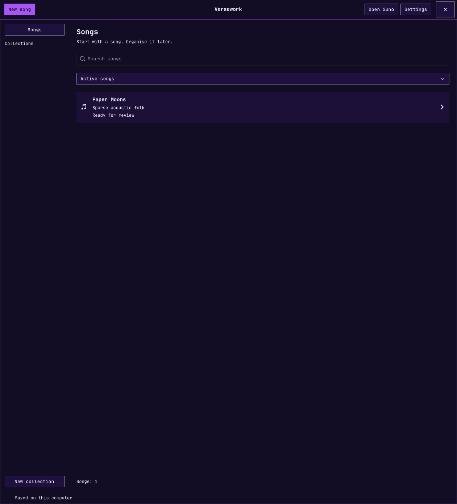
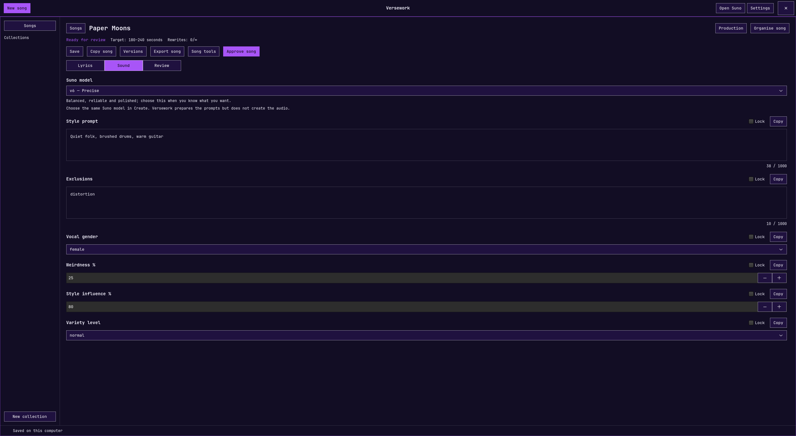
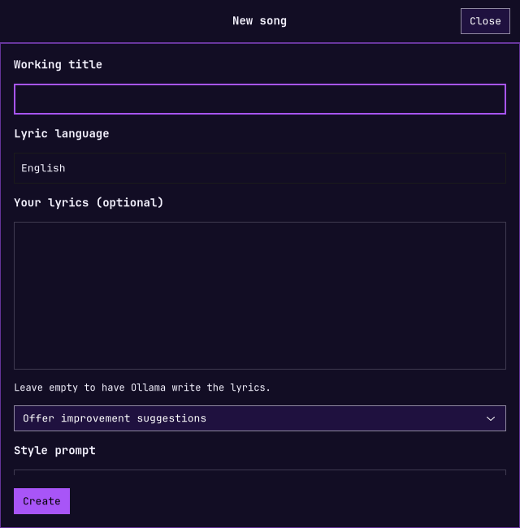

# Versework — Omarchy Song Creator

A native GTK 4 app for writing **songs** with a local Ollama model. Develop a song on its own, collect ideas around a theme, and organise an album or EP when you want to. Copy the finished lyrics and settings into Suno yourself; no Suno API is needed.



*Keep every draft in one searchable, song-first library.*



*Shape lyrics, Suno-ready sound settings, delivery cues, and revisions in one focused editor.*



*Start from a style brief or bring your own lyrics, with Ollama suggestions or exact preservation.*


*Tune arrangement density, dynamics, vocal delivery, performance feel, and drum groove before writing.*


*Use your Omarchy theme, configure rewrite limits, choose a language, and manage local writing and updates from Settings.*

## Review, refine and recover


- **Review before accepting.** Rewrites show a saved/proposed comparison. Keep changes field by field; discarding a proposal does not consume a rewrite. Supplied lyrics in suggestion mode also get a review step.
- **Choose the rewrite scope.** Change lyrics, sound settings, a section identified by its bracketed heading, or all unlocked fields. Preserved lyrics retain your latest saved manual edits.
- **Set your own limits.** Use a finite rewrite allowance or unlimited rewrites, including for new songs. Settings changes affect the default; applying a limit to existing songs is an explicit choice.
- **Preview production direction.** Inspect the delivery cues and character counts, see conflicting choices, and reuse saved production presets. Drum feel stays on Follow style until you choose otherwise. Fixed cues are assembled locally rather than relying on Ollama to repeat them exactly.
- **Organise experiments.** Song tools provides duplication, archive, recoverable trash, a Suno result link, and listening notes associated with the current version.
- **Resume work.** Failed or interrupted batch jobs are retained for retry, including after restarting the app. Successful drafts remain saved.
- **Protect the library.** Versework creates a local SQLite backup at startup and retains ten backups. Settings provides manual backup, restore with a safety backup, and import of exported `history.json` files.
- **Recover an update.** The updater retains the previous installed app. Restore it from Settings, or run the installed `launch.sh --rollback` if the new app cannot open. Songs remain in the separate data directory.

Automatic backups live in the app data directory under `backups`. Data respects `XDG_DATA_HOME`, or `VERSEWORK_DATA` when explicitly set. Production directions remain creative requests; Versework does not generate or assess Suno audio.

## Why Versework

| Create | Refine | Organise | Handoff |
| --- | --- | --- | --- |
| Start with a style brief, theme, duration, and optional lyrics. | Refresh lyrics, request rewrites, preserve locked fields, and keep version history. | Collect songs around a theme, then shape an album or EP when it makes sense. | Copy the finished lyrics and Suno settings, or open Suno directly from the app. |

Versework keeps the creative loop local and reviewable: Ollama writes on your computer, every generated field remains editable, and your saved songs stay in a local SQLite library. Production controls cover arrangement density, dynamics, vocal delivery, performance feel, and drum groove—from machine-perfect to a loose Sunday night in the pub.

## Install on Omarchy

```bash
git clone https://github.com/Ashcutus/Omarchy-Versework.git &&
cd Omarchy-Versework &&
./install.sh &&
./setup-ollama.sh
```

The installer asks where to place the music-note icon: **Left**, **Middle**, **Right**, or **No icon**. Click the icon to open Versework. It follows the bar's native theme. This requires the Omarchy shell and installation from a terminal in your running desktop session.

To move the icon later, rerun the installer and choose another position. This moves the existing icon without duplicating it. **Keep current layout** leaves its placement unchanged; **No icon** disables a previously installed icon. Other bar widgets are preserved.

For an installation without prompts:

```bash
./install.sh --bar-position middle
```

Use `left`, `middle`, `right`, `none`, or `keep`. Without a terminal or an explicit option, the installer keeps the existing bar layout.

Search for **Versework — Song Creator** in the app launcher. The installer copies the app to `~/.local/share/versework/app` and adds a user-level desktop entry. Run `./install.sh` again after updating the repository, then close and reopen Versework. Your saved work is kept separately.

GTK 4 and Python GObject are normally already installed on Omarchy. If needed:

```bash
omarchy pkg add python-gobject gtk4
```

`setup-ollama.sh` installs `ollama` and `ollama-vulkan` through Omarchy, starts a loopback-only Ollama server, and downloads **qwen3:8b** (approximately 5 GB). Package installation may ask for your system password. Vulkan acceleration depends on the GPU driver and Ollama build.

To use a different local model, pass its name to the setup script. Then choose **Settings → Local writing → Check connection**, select it, and **Apply**. If Ollama is stopped after restarting your computer, use **Start Ollama** in the same section. No cloud model or API key is required.

To run directly from the repository:

```bash
./launch.sh
```

## Update Versework

Open **Settings → App updates → Check for updates**. If one is available, choose **Install update**, then **Restart Versework**. Updates come from this repository’s main branch and require internet access and Git. No terminal or administrator password is needed.

The updater stages and validates the new app before replacing the installed files. Your songs, settings, Ollama installation, and bar placement stay intact. If you run Versework directly from a source checkout, use the installed app for this feature.

To get this button in an older installation, merge the updater change, close Versework, and run this once from your repository folder:

```bash
git pull && ./install.sh --bar-position keep
```

## Songs first

Use **Open Suno** in the top bar to open Suno’s creation page in your default browser. Log in there if needed; Versework does not handle your Suno credentials or send song text automatically.

- **New song** starts with one song by default. Enter its working title, style, optional theme, lyric language, target duration range and rewrite limit. You can also paste **Your lyrics (optional)**. Leave them empty for Ollama to write; choose **Offer improvement suggestions** to let it revise while preserving your voice, or **Leave my lyrics unchanged** to use them exactly. You can request several song ideas at once.
- The **Songs** library shows all your songs, including unfinished drafts, and searches titles, styles and themes.
- Each song has **Lyrics**, **Sound** and **Review** tabs. All eight fields are editable and individually copyable: title, lyrics, style prompt, exclusions, vocal gender, weirdness %, style influence %, and variety (`off`, `normal`, `high`, `extra`, `max`).
- **Style prompt** and **Exclusions** each allow up to **1,000 characters**, including spaces and punctuation. Their editors show a live count and reject typing or pasting beyond the limit. This also applies to the initial style brief and AI output. Existing longer saved text is preserved for shortening; it is never silently truncated.
- **Refresh lyrics** on the Lyrics tab offers Light polish, Stronger chorus, Fresh lyrics, and Update delivery cues. Choosing one appends editable instructions to Review; it does not start generation. Click **Rewrite song** when ready. Existing locks and rewrite limits apply.
- Write a draft, give feedback, lock fields you want preserved exactly, and approve it when ready. Version history preserves earlier drafts and manual edits. The working title is metadata only and is never used as lyric material.
- Generate audio manually in Suno, then bring your listening notes back into **Review**. Target duration guides the writing; Suno determines the audio length.

## Control production and delivery

In **New song → Production direction**, choose production density, dynamics, vocal delivery and performance feel, then add specific arrangement notes. New songs default to **Restrained** production; other controls follow your style until you choose otherwise. Existing songs keep their original direction until you change it.

**Performance feel** offers **Natural and understated** (subtle timing variation and unforced phrasing), **Live-room performance** (responsive ensemble timing and minimal editing), or **Tight and polished**. Follow style leaves this choice open. These provide concrete delivery cues and exclusions; they cannot guarantee that Suno sounds human or remove every synthetic artefact.

**Drum feel** is a 0–100 slider from **Machine-perfect** to **Sunday night in the pub**, with session drummer, relaxed pocket and loose live drummer bands between them. The selected groove, velocity and fill language is sent to the style prompt, exclusions and lyric delivery cues. It is a request for a played feel, not random timing or a guarantee that Suno will reproduce it exactly.

Use the **Production** button on any song to adjust its next draft or rewrite. For a sparse result, try **Stripped back**, **Steady and contained**, and **Intimate solo**, with notes such as “Fingerpicked guitar and one dry lead voice; leave silence between phrases.”

For both new drafts and rewrites (including collection updates), Versework supplies explicit production phrases for the style prompt, bracketed performance cues for the lyrics, and relevant exclusions. It assembles these fixed cues locally in unlocked fields, respecting the selected rewrite scope and preserving supplied lyrics. It keeps style and exclusions within their character limits. Freeform arrangement notes are also sent as creative direction; their meaning is not automatically verified. Saving direction does not change existing lyrics: generate a draft or use Review to request a rewrite. Locked fields and rewrite limits still apply. Suno may interpret the instructions differently; this is creative direction, not direct control of its audio engine.

## Choose a Suno model

Choose the default for new songs in Settings or change the model on an individual song. Versework uses the choice to shape Ollama's lyric and style prompt, stores it with each song version, and includes it in copied/exported song text. Before creating in Suno, select the same model there: Versework prepares the prompts but does not submit or create audio.

- **v6** is Suno's flagship model for reliable, precise, polished generations. Its prompt favours a clearly ordered, detailed direction.
- **v6-wild** is designed for less predictable, more varied results. Its prompt keeps the core requirements firm while opening space for a couple of creative surprises.
- **v6-mini** is the faster, lighter option. Its prompt foregrounds a concise central idea and a few essential details.

Suno describes these model characteristics; the prompt-writing differences are Versework's practical guidance inferred from those descriptions, not official Suno prompt syntax or a guarantee of results. Plan availability may vary: Suno lists v6 and v6-wild for Pro/Premier and v6-mini for all plans. See [Suno's current model overview](https://help.suno.com/en/articles/13924801), [model picker instructions](https://help.suno.com/en/articles/13924993), and [v6 FAQ](https://help.suno.com/en/articles/13924481).

## Optional collections, albums and EPs

Use **New collection** to name a group, give it a theme and choose songs. A collection may be labelled **Collection**, **Album** or **EP**; change that at any time under **Manage collection**. The up/down controls determine running order. A song can belong to more than one collection.

Use **Organise song** from the editor to change membership. Removing a song from a collection leaves the song and every saved version in the library. Collection themes add context when writing a song opened from that collection; they do not overwrite individual song briefs or lyric languages. Songs opened from the unfiltered library use their own brief.

**Review songs** lets you apply feedback to selected eligible songs in a collection. Approved songs and songs at their rewrite limit are excluded. **Export** saves readable song text plus a JSON snapshot of the selected songs, creative briefs and version histories.

Earlier multi-song projects are automatically represented as collections on first launch of this version. The original song records, approvals, locks and rewrite histories remain unchanged. This migration runs only once.

## Appearance and interface language

**Settings** is always dismissible with **Close**, the window close control, or **Escape**. Closing discards changes that have not been applied. **Apply** saves preferences and closes Settings, including when nothing has changed. If validation fails, Settings stays open so you can correct the error. Local writing controls are in a collapsible section and are not required for changing appearance or closing the window.

Under **Rewrite limits**, set the default number of AI rewrites per song or enable **Disable rewrite limits completely**. The setting changes the default for new songs. Select **Apply this limit to existing songs** to update the library too. A zero limit still allows an initial draft but no rewrites.

### Theme and colours

The default is **Follow Omarchy theme**. Versework reads the active Omarchy palette at `~/.local/state/omarchy/current/theme/colors.toml` (with the older `~/.config/omarchy/current/theme` location as a fallback) and follows changes automatically. The interface uses Omarchy’s configured monospace font, compact square controls, thin accent borders, and subdued panels. It leaves desktop settings and global configuration untouched. If no Omarchy palette is available, GTK supplies the native colours; the app does not force dark mode.

Choose **Custom colours** to change Versework's background, surfaces, text and accent using colour pickers or six-digit hex values. **Restore theme colours**, then **Apply**, returns to automatic theme following. These preferences affect Versework only.

### Interface language

The default is **System language**, resolved from the user's locale environment (`LC_ALL`, `LC_MESSAGES`, `LANG` and GNU `LANGUAGE` preferences). Available translations: **English, German, Spanish and French**. Unsupported system languages fall back to English. The setting remains “system” rather than storing a detected language, so future launches follow locale changes.

You may explicitly select an interface language. This changes menus, buttons and built-in interface text, **not song content, creative briefs or lyric language**. Generated content and detailed external service errors remain in their original language.

## Revision rules

- Initial drafts do not consume a rewrite.
- Only a successfully validated, saved AI revision increments the song's counter. Unchanged output, even if its notes claim changes, is rejected without using a rewrite.
- Manual edits and restoring an earlier version do not use an AI rewrite or reset the counter.
- Approved songs are protected until reopened. Reopening does not reset the rewrite limit.
- Reaching the limit marks a song **Limit reached · review needed**; it never approves a song automatically.
- Locked fields are enforced by the app.
- Initial drafts are checked for repeated substantial lines from other songs in the writing context. Two or more repeated lines trigger one automatic retry; a second duplicate result is rejected. This exact-line check is not a guarantee of originality.
- Completed drafts are saved as generation progresses. A later failure does not discard earlier songs.
- **Stop writing** cancels at the next streamed response; first-time model loading may delay cancellation. Closing preserves completed, saved drafts.

## Storage and privacy

Songs, collections, settings and version history are stored in `~/.local/share/versework/data/projects.sqlite3` using SQLite transactions. Back up the whole data folder while the app is closed to preserve full app state. Exports are readable text and JSON snapshots; the app does not yet import those JSON exports.

For AI writing, the app only connects to `http://127.0.0.1:11434`, bypasses HTTP proxies, and excludes models advertised as cloud or remote. Its Ollama startup sets `OLLAMA_NO_CLOUD=1`. Downloading a model needs internet access; writing uses the installed local model. Ollama may stay running after the app closes and logs to `~/.local/share/versework/data/ollama.log` when started by Versework.

## Development and validation

Python 3.11+, GTK 4.10+ and PyGObject are the app dependencies. There are no pip dependencies. Ollama is accessed through its documented streaming `/api/generate` API with a JSON schema and local validation.

```bash
python -m unittest discover -v
python -m py_compile app.py core.py appearance.py i18n.py
bash -n install.sh launch.sh setup-ollama.sh
```

The tests cover revision and approval rules, duplicate/unchanged output, persistence, collection migration and membership, generation context, palette validation and locale selection. Run the native UI smoke test with an isolated data directory:

```bash
VERSEWORK_DATA=/tmp/versework-smoke ./launch.sh --smoke
```

It verifies native editor construction, approval/reopening, settings dismissal without applying, settings reopening, language/colour application and reset, and preservation of song content. It renders `preview.png`, `settings.png` and `library.png` into that isolated directory and exits. It uses labelled fixtures and does not call an LLM.

API references: [Ollama generate](https://docs.ollama.com/api/generate), [structured outputs](https://docs.ollama.com/capabilities/structured-outputs).

MIT licensed. See [LICENSE](LICENSE).
